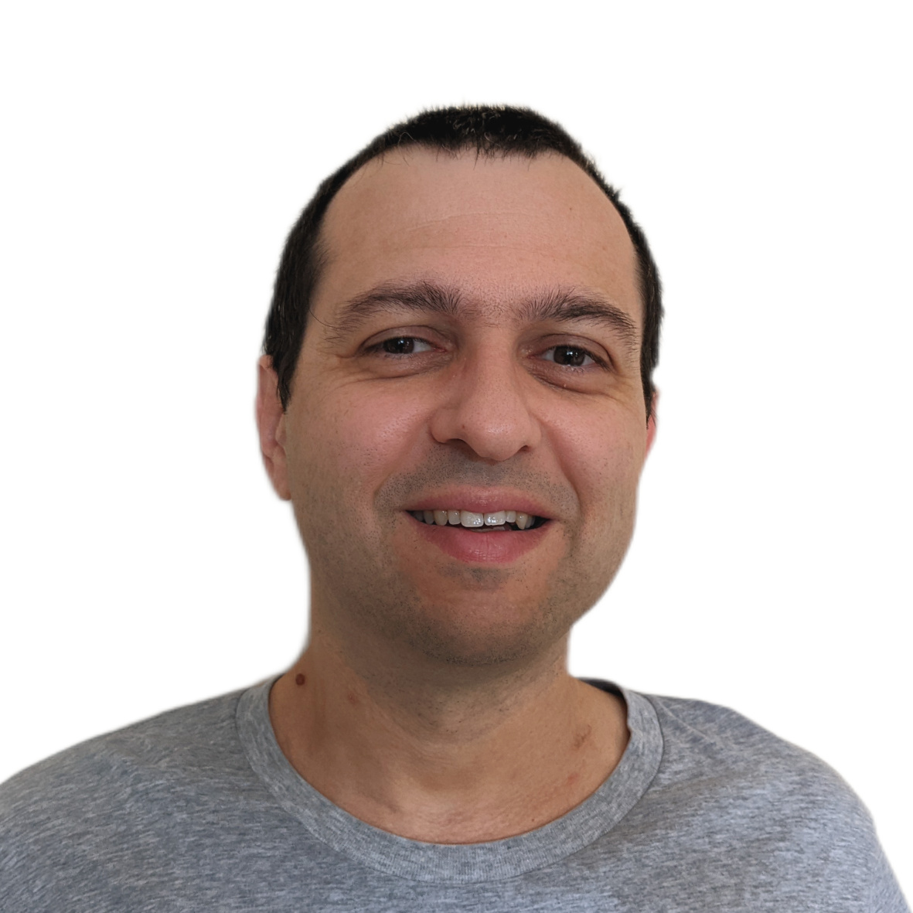

# PALLEAU Michel

Ingénieur développement logiciel embarqué -- Expert

{: .portrait}

**FR** [<i class="fa-solid fa-arrow-right-long"></i> **EN**](index.html)
{: .language}

|:-:|:-:|
|42 ans -- 3 enfants|[<i class="fa-brands fa-github fa-lg"></i> mic006](https://github.com/mic006)|
|<i class="fa-solid fa-house"></i> Toulouse -- France|[<i class="fa-brands fa-linkedin fa-lg"></i> michel palleau](https://www.linkedin.com/in/michel-palleau-a273077/)|

[<i class="fa-solid fa-at fa-lg"></i> michel.palleau-at-gmail.com](mailto:michel.palleau-at-gmail.com)
{: .no-margin}

**Anglais courant ~B2/C1** 
Français langue maternelle

## Synopsis
{: .synopsis}

Passionné depuis tout jeune par l'informatique, j'ai maintenant 20 ans d'expériences professionnelles
en développement de logiciel embarqué. Je suis spécialisé dans les couches basses, et j'ai travaillé
dans les domaines de la téléphonie mobile et de l'automobile, côté driver, kernel et aussi applicatif embarqué.

Ma mission idéale&#8239;: partir des besoins et contraintes projet pour définir et concevoir une solution, la développer et
l'amener à maturité, le tout en environnement contraint.

Je suis passionné, déterminé, persévérant et efficace. Je peux travailler seul, mais j'apprécie aussi
le travail en équipe, tant en local qu'à l'international.

## Langages et outils
- Expert en **𝐂** et <i class="fa-brands fa-python fa-xl"></i> **Python**
- Maîtrise de **𝐂++**, GoogleMock, Makefile, CMake, Shell, <i class="fa-brands fa-java fa-xl"></i> Java, PlantUML
- OS&#8239;: **GNU / Linux** (pro et perso)
- Version&#8239;: <i class="fa-brands fa-git-alt fa-xl"></i> <i class="fa-brands fa-git fa-lg"></i>
{: .page-break}

## Qualité logicielle
- Travail en équipe, en binôme
- Encadrement technique des juniors
- Environnement international et multi-culturel
- Amélioration continue
- Revue et **modération** des changements de code
- **Méthode agile**, 
certification **SAFe**  <small>(SAFe 5 Practitioner -- 21 Oct 2021)</small>
- Documentation intégrée au code avec **Doxygen**, Graphviz et PlantUML

## Compétences logiciel embarqué
- **Architecture** et développement modulaire de logiciel
- Gestion de périphérique hardware, réalisation de driver
- Développement avec contraintes **temps-réel**, gestion d'interruptions, système multitâches et multicœurs (RTOS et Linux)
- **Optimisation** des ressources mémoires, CPU
- Contraintes des systèmes à base de **mémoire flash NAND**: limitation des écritures, accès par bloc, stratégie de rétention des données
- Maîtrise des bus de communication&#8239;: CAN, LIN, Ethernet, UART
- Connaissance des architectures Classic & Adaptive 
- **Test unitaire**, couverture de tests
- Intégration sur système cible **ARM**
- Développement d'outils et de scripts (Python)
- Identification et résolution de **problèmes complexes**
- Analyse et revue de documentation technique interne et externe, en anglais
- Écriture de support et réalisation de présentations techniques en anglais (mémoire flash NAND)

## Expériences professionnelles

### Continental Automotive (Toulouse -- France) 

2020 -- Auj **Ingénieur Expert sur plateforme télématique, Linux embarqué**
- Développement et maintenance de drivers kernel, bibliothèques et applications
- Expertise sur les problématiques de maintenance de la mémoire flash (raw NAND et eMMC)
- Architecture, développement et déploiement d'une solution générique de maintenance de mémoire flash

2018 -- 2020 **Architecte développement solution FOTA, Linux embarqué**
- Intégration de la solution Flash Over the Air de Redbend 
- Architecture, développement et support de la couche interface pour intégrer la solution RedBend sur une plateforme Adaptive Autosar

2013 -- 2018 **Responsable fonction Communication, MCU temps-réel**
- Encadrement de 6 personnes en multi-sites (Inde, Roumanie, France)
- Développement et support de la pile Communication (CAN, LIN, UART) sur une solution légère propriétaire et sur plateforme Classic Autosar
- Intégration, validation et vérification des performances de la pile Ethernet sur plateforme Classic Autosar
{: .page-break}

### Motorola (Toulouse -- France) 

2003 -- 2013 **Ingénieur développement logiciel embarqué, modem de téléphone portable** 
- Développement et maintenance de drivers pour périphériques HW et modem L1 pour la technologie LTE
- Ré-architecture complète et extension de la couche de gestion RF pour supporter une nouvelle architecture multicœurs et multi RF
- Suivi de bout en bout d'une évolution de la plate-forme avec une nouvelle radio&#8239;; analyse de la documentation fournisseur, architecture et développement du driver RF, première intégration sur cible, puis développement, optimisation et stabilisation jusqu'à la commercialisation

## Formation initiale

2000 -- 2003 **Ingénieur diplômé, spécialisation génie logiciel, à CentraleSupélec**, à Gif/Yvette (France)

1998 -- 2000 **Classe préparatoire aux grandes écoles**, MPSI / MP* au lycée Descartes à Tours (France)

## Centres d'intérêt

- Passionné de technologie, je fais de la veille technologique et m'auto-forme régulièrement sur des projets personnels (Raspberry Pi <i class="fa-brands fa-raspberry-pi fa-lg"></i>, algorithmie, HTML <i class="fa-brands fa-html5 fa-lg"></i>, CSS <i class="fa-brands fa-css3-alt fa-lg"></i>)
- Amateur de jeux de mathématiques et de logique, en particulier de Bridge 

